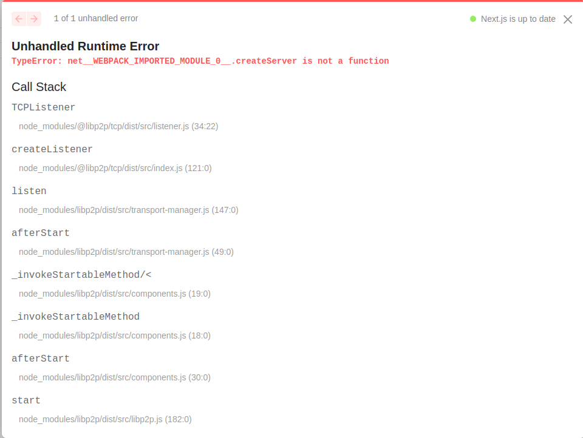

# Decentralized Storage System with Incentives

This project aims to leverage the power of decentralized systems, allowing users to store and pin data in a distributed fashion. We utilize the IPFS protocol for pinning data and libp2p for seamless peer-to-peer transfers. What's unique about our system? We offer custom incentives for participants who store and pin data on their local computers!

## Features

- **Decentralized Storage:** Utilize IPFS for effective and decentralized data storage.
- **Peer-to-Peer Transfers:** Leverage libp2p for efficient data transfer among peers.
- **Incentivization System:** Get rewarded for contributing to the network by pinning and storing data.

## Goals and Progress
#### Progress
Currently we have successfully set up a helia node and a dropzone where we can upload the file to `IPFS` and get their `cid` and retreive the files using the `cid` on the site. Currently the networking layer is not set up which would facilitate in the data transfer among peers. 
#### Goals
The ultimate goal is to transfer the `cid` from a particular peer to another and then giving some incentive to the peers to pin the sent `cid` and store it on their system.

---

## Technologies Used

- [IPFS](https://ipfs.io/) - For decentralized storage and pinning of data. 
  - [IPFS Documentation](https://docs.ipfs.io/)
  - [Helia GitHub Repository](https://github.com/ipfs/helia)
- [libp2p](https://libp2p.io/) - A modular network stack that allows peer-to-peer networking for any system.
  - [libp2p Documentation](https://docs.libp2p.io/)
  - [js-libp2p GitHub Repository](https://github.com/libp2p/js-libp2p)
- [Next.js](https://nextjs.org/) - For building our user interface.
  - [Next.js Documentation](https://nextjs.org/docs)


---


## Getting Started

1. Clone the repository:
   ```
   git clone https://github.com/MutantShakes/IPFS_WSL.git
   ```

2. Navigate to the project directory and install dependencies:
   ```
   cd IPFS_WSL && npm install
   ```

3. Start the Next.js application:
   ```
   npm run dev
   ```
---

## Description of Files in `app/components/` directory

1. ### `Dropzone.js`
   It contains two basic IPFS operations creating a helia node , getting it's cid on IPFS and retreiving the file from IPFS and downloading it.

   Setting `Helia Node` and getting the peerID

   ```javascript
       //  setting heliaNode -------------------------------------------------------

     useEffect(() => {
    const init = async () => {
      if (helia) return

      setOutput("Creating Helia Node")
      const heliaNode = await createHelia({
        blockstore
      })

      const nodeId = heliaNode.libp2p.peerId.toString()
      const nodeIsOnline = heliaNode.libp2p.isStarted()

      setHelia(heliaNode)
      setId(nodeId)
      setIsOnline(nodeIsOnline)
    }
    init()
    if(isOnline) setOutput("Node Online....")
     }, [helia,isOnline])

   //  ----------------------------------------------------------------------
   
   ```

   Adding a file to the `IPFS` and getting the corresponding `cid`
   ```javascript
   // adding file (getting cid) --------------------------------------------------
   useEffect(() => {
    if(file){
      const init = async() =>{
      const encoder = new TextEncoder()

      const fs = unixfs(helia)

      setFs(fs)

      setOutput(`Adding file...`)

      const cid = await fs.addBytes(await readFileAsUint8Array(file))

      setCid(cid)

      setOutput(`Added to ${cid}`)

      setOutput(`Preview: https://ipfs.io/ipfs/${cid}`)
      }
      init()
    }

   }, [file])

   ```

   Retreiving file from `IPFS` using the `cid` 

   ```javascript
   // retreiving file from IPFS
   useEffect(() =>{

   if(cidName){
    setOutput('Reading file...')
    const init = async() =>{
      // Retrieve the file from IPFS
      const fs = unixfs(helia)
      const stream = fs.cat(cidName);

      let data = Buffer.alloc(0);

      for await (const chunk of stream) {
        data = Buffer.concat([data, chunk]);
      }
     console.log("data is:",data)

     setText(data.buffer)
     console.log(data.buffer)
     setOutput("Data Read")
    }

    init()
   }

   },[cidName])

   // -----------------------------------------------------------------------------
   
   ```
3. ### `networking.js`
   This file creates a `libp2p` node.

   ```javascript

     // libp2p is the networking layer that underpins Helia
     const libp2p = await createLibp2p({
    datastore,
    addresses: {
      listen: [
        '/ip4/127.0.0.1/tcp/1'
      ]
    },
    transports: [
      tcp()
      
    ],
    connectionEncryption: [
      noise()
    ],
    streamMuxers: [
      yamux(),mplex()
    ],
    peerDiscovery: [
      bootstrap({
        list: [
          '/dnsaddr/bootstrap.libp2p.io/p2p/QmNnooDu7bfjPFoTZYxMNLWUQJyrVwtbZg5gBMjTezGAJN',
          '/dnsaddr/bootstrap.libp2p.io/p2p/QmQCU2EcMqAqQPR2i9bChDtGNJchTbq5TbXJJ16u19uLTa',
          '/dnsaddr/bootstrap.libp2p.io/p2p/QmbLHAnMoJPWSCR5Zhtx6BHJX9KiKNN6tpvbUcqanj75Nb',
          '/dnsaddr/bootstrap.libp2p.io/p2p/QmcZf59bWwK5XFi76CZX8cbJ4BhTzzA3gU1ZjYZcYW3dwt'
        ]
      })
    ],
    services: {
      identify: identifyService()
    }
     })

   ```

   And it returs a `Helia Node` instance which can be used in our `Dropzone.js` to create helia node with a `libp2p` layer
   ```javascript

     return await createHelia({
    datastore,
    blockstore,
    libp2p
     })

   ```

  Currently this file is not working and showing error when `createNode` from `networking.js` is used in the `Dropzone.js` file.
   ```javascript
      import {createNode} from './networking'


     //  setting heliaNode
      const heliaNode = await createNode()

   ```
   
   
   
---

## References & Libraries

- [IPFS GitHub Repository](https://github.com/ipfs/ipfs)
- [libp2p GitHub Repository](https://github.com/libp2p/libp2p)
- [Next.js GitHub Repository](https://github.com/vercel/next.js/)
- [Helia-js Examples](https://github.com/ipfs-examples/helia-examples)
- [js-libp2p GitHub Repository](https://github.com/libp2p/js-libp2p)
- Additional readings:
  - [IPFS Whitepaper](https://ipfs.io/ipfs/QmR7GSQM93Cx5eAg6a6yRzNde1FQv7uL6X1o4k7zrJa3LX/ipfs.draft3.pdf)
  - [libp2p Specification](https://github.com/libp2p/specs)


---

## Acknowledgements

Parts of our code were inspired by or adapted from the following sources:

- [Helia-js Examples](https://github.com/ipfs-examples/helia-examples)
- [js-libp2p GitHub Repository](https://github.com/libp2p/js-libp2p)

---


